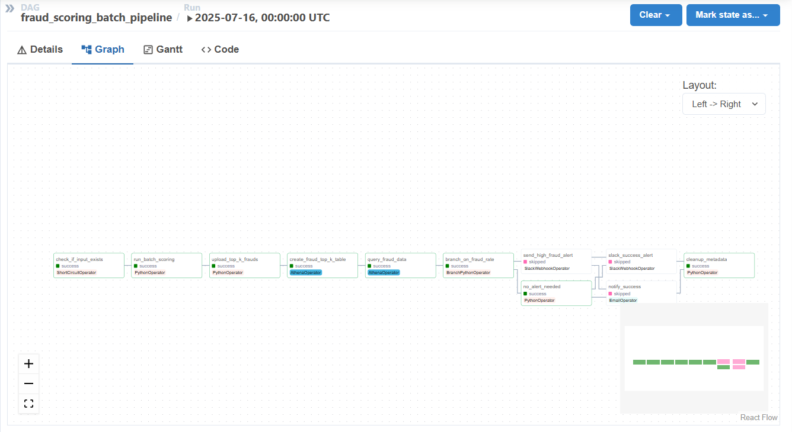

# AWS-Integrated Fraud Detection Pipeline

A modular, production-ready pipeline to detect fraudulent transactions using machine learning and AWS-integrated orchestration. Built with Apache Airflow and designed for scalability, automation, and clarity.

---

## Project Motivation

As a data science undergraduate with deep interest in the AWS ecosystem and real-world data engineering workflows, I designed this project to simulate how fraud detection is operationalized in large-scale financial institutions.

In the modern fintech and banking sectors, **fraud detection is not just about modeling** — it's about designing **resilient, automated, and scalable data pipelines** that support risk teams with reliable, interpretable outputs. My goal was to **replicate the real-world lifecycle of a fraud detection system**, focusing on how it would be implemented using:

- **Airflow** for batch orchestration  
- **AWS S3** for cloud data ingestion and output  
- **LightGBM & Logistic Regression** for fast and scalable ML inference  
- **Threshold tuning** to adjust to business trade-offs between false positives and missed frauds  
- **Python utilities** for SQL generation and pipeline integration  

---

## Fraud Detection in Risk Management: Why It Matters

Fraud detection is a core pillar of **operational risk management** in the financial industry. Unlike typical ML tasks, fraud pipelines require:

- **Real-time or frequent batch scoring** to catch risky transactions quickly  
- **Feature consistency** between training and inference  
- **Business-aligned thresholds** tuned for precision vs recall depending on fraud cost  
- **Cloud-native data handling**, often leveraging tools like S3, Athena, Lambda, or Kinesis  
- **Explainability and monitoring**, so decisions can be audited or challenged

This project demonstrates how these concerns can be **prototyped in an end-to-end pipeline** — from EDA and model development in notebooks, to automated scoring and AWS-integrated output via Airflow DAGs.

---

## My AWS Motivation

I built this pipeline specifically to **practice MLOps principles** within the AWS ecosystem as part of my preparation for the **AWS Data Engineer Associate Certification (DEA-C01)**.

By combining open-source tools like Airflow with AWS services, I aimed to bridge the gap between:

- Research-grade ML models  
- And Production-grade risk management pipelines


## Overview
This project processes transaction data, applies trained ML models to detect fraud, and outputs scored results to AWS S3. Built for real-world readiness, it includes:

- ETL via Airflow DAGs
- Model inference (LightGBM, Logistic Regression)
- Threshold optimization
- Batch scoring pipeline
- S3 integration for input/output
- Modular utilities for SQL schema generation

---

## Key Features

- ✅ **Airflow DAG**: `fraud_scoring_dag.py` runs batch jobs with retry logic
- ✅ **Pre-trained Models**: `lightgbm_model.pkl`, `logistic_regression.pkl`
- ✅ **Sample Data Support**: Use `sample_transactions.csv` for demo/testing
- ✅ **AWS S3 Output**: Auto-writes predictions to S3 (or local fallback)
- ✅ **Notebook Pipeline**: From EDA → model training → threshold tuning
- ❌ (Optional) Real-time API or Streamlit frontend under development

---

## Project Structure

```bash
├── dags/
│   └── fraud_scoring_dag.py
├── data/
│   ├── raw/
│   │   └── sample_transactions.csv        
│   └── processed/
│       └── labeled_predictions.csv        
├── metadata/                              # ❌ ignored (auto-cleaned)
├── models/
│   ├── lightgbm_model.pkl
│   ├── logistic_regression.pkl
│   └── expected_features.pkl
├── notebooks/
│   ├── 01_eda.ipynb
│   ├── 02_model_dev.ipynb
│   └── 03_threshold_opt.ipynb
├── scripts/
│   ├── batch_scoring_pipeline.py
│   └── sample_data_to_s3.py
├── utils/
│   └── athena_dd_generator.py
├── .devcontainer/
│   └── devcontainer.json
├── .gitignore
├── requirements.txt
├── LICENSE
└── README.md
```
---

## Handling Large Files

Some datasets used in this project are too large to include directly in the repository.

| File | Location | Action |
|------|----------|--------|
| `creditcard.csv` | data/raw/ | ❌ Not included (too large) |
| `creditcard_clean.csv` | data/processed/ | ❌ Not included (too large) |
| `sample_transactions.csv` | data/raw/ | ✅ Included |
| `labeled_predictions.csv` | data/processed/ | ✅ Included |

To run on the full dataset, you can download it manually and place it in the correct folder:

```bash
wget https://kaggle.com/creditcard.csv -O data/raw/creditcard.csv
```

---

## System Architecture

This project follows a modular, cloud-ready architecture for batch fraud scoring and risk flagging.

```text
     ┌────────────────────┐
     │  New Transactions  │
     │   (sample .csv)    │
     └────────┬───────────┘
              │
              ▼
     ┌────────────────────┐
     │   Airflow DAG      │  (fraud_scoring_batch_pipeline)
     └────────┬───────────┘
              │
              ▼
     ┌────────────────────┐
     │  Model Inference   │  (LightGBM / LogisticRegression)
     └────────┬───────────┘
              │
              ▼
     ┌────────────────────┐
     │ Save Top K Results │
     │    to S3 (or local)│
     └────────┬───────────┘
              │
              ▼
     ┌────────────────────┐
     │  Athena Table      │
     │  Creation + Query  │
     └────────┬───────────┘
              │
              ▼
     ┌────────────────────────────┐
     │  Fraud Rate Check (Branch) │
     └────────┬────────────┬──────┘
              │            │
   High Fraud ▼            ▼ Low/Normal
     ┌──────────────┐     ┌─────────────┐
     │ Slack Alert  │     │ No Alert    │
     └────┬─────────┘     └────┬────────┘
          ▼                       ▼
     ┌────────────────────────────────┐
     │    Email + Slack (if enabled)  │
     └────────────────────────────────┘
```

## Notebooks Summary

This project includes three main Jupyter notebooks that guide the entire ML workflow:

| Notebook | Purpose |
|----------|---------|
| `01_eda.ipynb` | Perform exploratory data analysis, check class imbalance, apply PCA to visualize the fraud detection challenge. |
| `02_model_dev.ipynb` | Train two fraud classifiers — LightGBM and Logistic Regression — with evaluation using F1, ROC-AUC, and confusion matrix. |
| `03_threshold_opt.ipynb` | Optimize the fraud threshold to balance between precision, recall, and F1-score depending on business risk sensitivity. |

All notebooks use the same preprocessed or sampled dataset, making them modular and runnable independently.

---

## 🔄 Batch Scoring Pipeline: Airflow DAG

The project includes a scheduled Airflow DAG that runs the end-to-end fraud scoring and alert pipeline. It performs:

1. Input existence check
2. Batch scoring using ML models
3. Top-k fraud extraction
4. Table creation and querying via AWS Athena
5. Fraud rate branching logic
6. Slack alert + Email notification
7. Metadata cleanup

Here’s a snapshot of the full DAG run:



This automated pipeline provides several key benefits to risk and fraud teams in a real-world fintech or banking environment:

### 1. Proactive Risk Monitoring  
Rather than reacting after the fact, this pipeline **automatically flags high-risk days** and triggers alerts when fraud rates exceed a business-defined threshold. This allows human analysts to **intervene early**, potentially stopping fraud escalation.

### 2. Time-Saving & Scalable  
Manual scoring and review is not scalable. This DAG ensures that **model inference, database updates, and alerting happen automatically**, reducing the operational load on data teams while maintaining reliability.

### 3. Data-Driven Decision Making  
By structuring results in AWS Athena and S3, this pipeline enables **daily fraud metrics** and makes it easy to plug results into dashboards, BI tools, or downstream audit reports.

### 4. Repeatability & Auditability  
With a well-structured DAG and logs, **every batch run is reproducible** and traceable — a critical requirement for compliance and regulatory reporting in financial services.

### 5. Cloud-Optimized Architecture  
Using AWS-native components (Athena, S3) means this solution is **cost-effective**, **serverless**, and easy to scale for high volumes of transactions.


✅ This kind of automation is foundational in any real-world fraud detection system — not just to score transactions, but to **operationalize ML models** and close the loop between detection, response, and risk control.

---

## Local Development Setup Guide

You can run this fraud detection pipeline entirely on your local machine or in GitHub Codespaces by following the steps below.

---

### 1. Clone the Repository

```bash
git clone https://github.com/your-username/aws-fraud-detection.git
cd aws-fraud-detection
```

### 2. Create a Virtual Environment

It's recommended to isolate dependencies using a virtual environment.

```bash
# Create virtual environment
python -m venv venv

# Activate it
source venv/bin/activate       # On Windows: venv\Scripts\activate

# Install project dependencies
pip install -r requirements.txt
```

### 3. [Optional] Use GitHub Codespaces or DevContainer

If you're using **GitHub Codespaces** or **VS Code Remote - Containers**, this project includes a `.devcontainer/devcontainer.json` file pre-configured with:

- Python + Airflow environment
- Auto-installed dependencies
- Proper volume mounts for data and logs

**To use it:**
1. Open the repo in GitHub.
2. Click the green **“Code”** button → **“Open with Codespaces”**.
3. Create a new Codespace.
4. Everything will auto-build and be ready to run.

This is the easiest way to explore the Airflow DAGs without installing anything locally.

### 4. Set AWS Credentials

To enable AWS S3 and Athena integration, create a `.env` file in the project root with your AWS credentials:

```env
AWS_ACCESS_KEY_ID=your_aws_access_key
AWS_SECRET_ACCESS_KEY=your_aws_secret_key
AWS_REGION=ap-southeast-1
```
> These credentials are used by boto3 to upload output files and query AWS Athena.
Important Notes:
- Never commit this `.env` file to git.
- It is already included in `.gitignore` for safety.
- If you're running in GitHub Codespaces, you can set these as repository-level secrets and load them in a startup script or via environment variables.

### 5. Initialize and Run Airflow

After setting up your environment and credentials, initialize Airflow and start the necessary services.

```bash
# (Optional) Define Airflow home directory
export AIRFLOW_HOME=$(pwd)/airflow

# Initialize Airflow's metadata DB
airflow db init

# Create an admin user (only needed once)
airflow users create \
    --username admin \
    --firstname Steve \
    --lastname Kwon \
    --role Admin \
    --email you@example.com \
    --password admin
```

Then, start the Airflow web interface:
```bash
airflow webserver --port 8080
```
Open your browser and go to http://localhost:8080

In a **new terminal**, start the scheduler:
```bash
airflow scheduler
```
> Airflow uses both a webserver (for the UI) and a scheduler (to execute tasks). Both must be running.

### 6. Trigger the DAG

Once the webserver and scheduler are running, you can trigger the DAG either from the Airflow UI or directly via the CLI.

#### Option 1: Use the Airflow UI
1. Go to [http://localhost:8080](http://localhost:8080)
2. Locate the DAG named `fraud_scoring_batch_pipeline`
3. Click the toggle to activate it (if paused)
4. Click the ▶️ (play) button to trigger a DAG run

#### Option 2: Use the CLI

```bash
airflow dags trigger fraud_scoring_batch_pipeline
```

>  The DAG will execute all tasks from data input validation to scoring, Athena querying, alerting (if needed), and metadata cleanup.

### 📄 7. View Output

Once the DAG has finished running, your scored fraud predictions will be saved locally and (optionally) uploaded to AWS S3.

#### 📁 Local Output
Check the following file:

`data/processed/labeled_predictions.csv`

This file includes the original transaction data along with the model's predicted fraud scores and binary labels based on your optimized threshold.

#### ☁️ S3 Output (if enabled)
If your AWS credentials and S3 bucket are correctly configured in `.env`, the same output file will be uploaded to your designated S3 location.

> 🧪 You can now query the output via Athena, explore the fraud results, or integrate them into a Streamlit dashboard or BI tool.


## Future Work: Phase 3 Roadmap

This project currently implements a production-ready batch pipeline with model inference and AWS integration (Phase 2). The following extensions are planned for the FinTech production-grade phase (Phase 3):

- **SHAP Explainability**  
  Add SHAP-based feature attribution to explain high-risk predictions.

- **Streamlit Front-End**  
  Build a fraud review dashboard for non-technical teams to analyze prediction batches.

- **Real-Time Scoring API**  
  Deploy the model behind a FastAPI service with AWS Lambda + API Gateway.

- **Monitoring & Drift Detection**  
  Track distribution shifts, AUC drops, or threshold deviation using dashboards and logs.

- **Alerting System**  
  Integrate Slack or SNS notifications when fraud ratio crosses risk thresholds.

*These additions would move the pipeline toward full MLOps maturity in a fraud detection context.*


